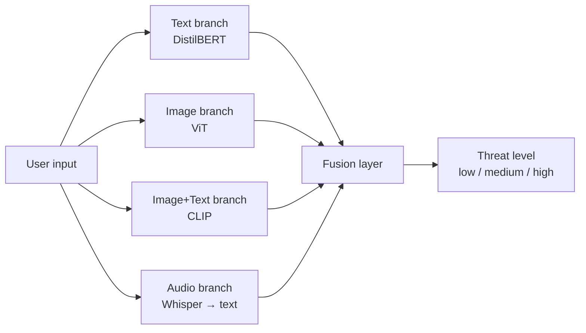

# Cyberbullying Detection System Using Machine Learning (Peacemaker)

## Overview
Peacemaker is a multimodal harassment detection AI system which first extracts data (messages, posts, captions) from user inputted social media accounts (Instagram, Telegram). Peacemaker contains DistilBERT for text classfication, ViT for image classfication and addition of Open AI's CLIP to extract text within images, Open AI's Whisper to transcript audio to text. Used late-fusion approach to have the response of these models together and give users a collaborative and grounded response. 

## Structure
- `models/`: Saved trained models (Ignored in Git, generated via training scripts).
- `src/`: Source code for preprocessing and training pipelines.
- `app/`: Streamlit web application.
- `tests/`: Unit tests.

## Installation & Setup
To run this project on a new local machine, follow these steps:

1. **Clone the repository:**
   ```bash
   git clone https://github.com/KishoharS/peacemaker.git
   cd peacemaker
   ```

2. **Set up a virtual environment (Recommended):**
   ```bash
   python -m venv venv
   source venv/bin/activate  # On Windows use: venv\Scripts\activate
   ```

3. **Install dependencies:**
   ```bash
   pip install -r requirements.txt
   ```
   *Note: For the audio analyzer, you may also need to install `ffmpeg` on your system (e.g., `brew install ffmpeg` on macOS, or via `apt` on Linux).*

## Generating the Models
**Important:** Model weights are not stored in this repo. Before running the app/API you must train locally to generate weights in `models/`.

### Train models locally
1. **Train the Text Model (DistilBERT):**
   ```bash
   python src/train_text.py
   ```
2. **Train the Image Model (ViT):**
   ```bash
   python src/train_image.py
   ```

## Usage
Once the models are generated and saved in the `models/` directory, you can launch the API + Streamlit frontend.

1. Copy env template:
   ```bash
   cp .env.example .env
   ```
2. Run the API (Flask):
   ```bash
   python backend_api.py
   ```
3. Run the web app (Streamlit):
   ```bash
   streamlit run app/app.py
   ```

Open your browser to the URL provided in the terminal (usually `http://localhost:8501`).

## Deployment (Render)
This repo includes a `render.yaml` and `Procfile` so you can deploy the Flask API quickly once your Hugging Face model IDs are public.

- **Service**: Python Web Service
- **Start command**: `gunicorn backend_api:app --bind 0.0.0.0:$PORT`
- **Env vars**: set `PEACEMAKER_TEXT_MODEL_PATH`, `PEACEMAKER_VIT_MODEL_PATH` (or bake models into the image / attach disk)

After deploy, paste your public URL here:
- API base URL: `TBD`

## Architecture (high level)


## Evaluation
### Text model metrics (example)
| Class | Precision | Recall | F1 |
|------:|----------:|-------:|---:|
| non-cyberbullying | TBD | TBD | TBD |
| cyberbullying | TBD | TBD | TBD |

To generate numbers:
- Train + write a text report JSON: `python src/train_text.py` (writes `eval_outputs/text_classification_report.json`)
- Quick multi-modal eval: `python src/evaluate_multimodel.py --max-samples 200` (writes `eval_outputs/multimodel_eval_results.json`)

## Demo
Add a short demo GIF here (30s screen capture is perfect):
- `docs/demo.gif` (TBD)
